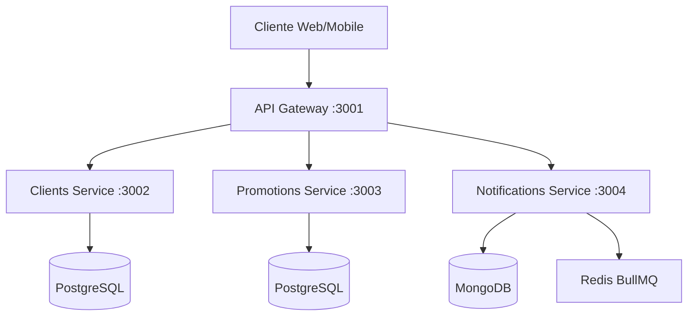

# Guía Técnica - Sistema de Promoción de Servicios

Documentación técnica completa del sistema: arquitectura, estructura, APIs y componentes.

---

## 🏗️ Arquitectura

### Microservicios Distribuida

El sistema ha evolucionado de un monolito a una arquitectura de microservicios para mejorar la escalabilidad, mantenibilidad y desacoplamiento de responsabilidades.



**Componentes Principales:**

1.  **API Gateway (Express + Http-Proxy-Middleware)**
    - Punto de entrada único.
    - Enrutamiento a microservicios.
    - Rate Limiting global.
    - Validación preliminar de Auth (opcional).

2.  **Clients Service (Node.js + PostgreSQL)**
    - Gestión de Usuarios (Operadores) y Clientes Finales.
    - Autenticación (JWT) y Autorización.
    - Metadata de clientes.

3.  **Promotions Service (Node.js + PostgreSQL)**
    - Lógica central de negocio: Promociones, Productos y Reglas.
    - Motor de elegibilidad de promociones.

4.  **Notifications Service (Node.js + MongoDB + BullMQ)**
    - Envío asíncrono de mensajes (Email, WhatsApp, Push).
    - Historial de notificaciones y logs.
    - Gestión de colas de envío.

5.  **Frontend Web (React + Vite)**
    - Panel de administración para operadores.
    - Consumo de APIs a través del Gateway.

---

## 📁 Estructura del Proyecto

```
/
├── api-gateway/           # Enrutador principal
├── clients-service/       # Microservicio de Clientes y Auth
├── promotions-service/    # Microservicio de Promociones
├── notifications-service/ # Microservicio de Notificaciones
├── frontend/              # Panel Web (React)
├── frontend-mobile/       # App Móvil (React Native)
├── docker-compose.yml     # Orquestación de infraestructura local
└── README.md              # Documentación general
```

### Estructura Típica de un Microservicio

Cada microservicio sigue una estructura similar (Clean Architecture / MVC):

```
src/
├── config/         # Configuración (DB, Env vars)
├── controllers/    # Manejadores de rutas
├── models/         # Modelos de datos (Mongoose/Sequelize/TypeORM)
├── routes/         # Definición de endpoints
├── services/       # Lógica de negocio pura
├── utils/          # Helpers y utilidades
├── app.ts          # Configuración de Express
└── index.ts        # Punto de entrada del servidor
```

---

## 🗄️ Bases de Datos

El sistema utiliza una arquitectura híbrida con una base de datos relacional compartida y una base de datos documental para logs.

### 1. PostgreSQL (Compartida)
Utilizada por **Clients**, **Promotions** y **Notifications Service**. Contiene el esquema unificado del negocio.

**Tablas Principales:**
- `users`: Operadores del sistema.
- `clients`: Clientes finales.
- `products`: Productos o servicios.
- `promotions`: Campañas promocionales.
- `notifications`: Registro transaccional de notificaciones.

### 2. MongoDB (Notifications)
Utilizado exclusivamente por el **Notifications Service** para logs de auditoría de alto volumen y datos no estructurados.

**Colecciones:**
- `notification_logs`: Historial detallado de envíos y respuestas de proveedores.

### 2. MongoDB (Notifications)
Utilizado para datos voluminosos y no estructurados como logs de notificaciones.

**Colecciones:**
- `notification_logs`: Registro histórico de envíos.
- `templates`: Plantillas de mensajes.

### 3. Redis (Infraestructura)
Utilizado para:
- **Colas de BullMQ**: Gestión de trabajos en segundo plano para envío de notificaciones masivas.
- **Caché**: (Opcional) Para endpoints de lectura frecuente.

---

## 🔌 API Reference (Vía Gateway)

Todas las peticiones deben dirigirse al API Gateway en el puerto `3001`.

### Autenticación & Clientes
- `POST /api/auth/login`: Iniciar sesión.
- `POST /api/auth/register`: Registrar operador.
- `GET /api/clients`: Listar clientes.
- `POST /api/clients`: Crear cliente.

### Promociones
- `GET /api/promotions`: Listar promociones activas.
- `POST /api/promotions`: Crear nueva campaña.
- `POST /api/promotions/:id/assign`: Asignar reglas a promoción.

### Notificaciones
- `POST /api/notifications/send`: Enviar notificación individual.
- `POST /api/notifications/bulk`: Enviar notificación masiva (Async).
- `GET /api/notifications/history`: Ver historial de envíos.

---

## 🔄 Flujos de Datos Clave

### 1. Envío Masivo de Promociones
1.  **Frontend**: Operador crea promoción y selecciona "Enviar Masivo".
2.  **Gateway**: Redirige petición a `Promotions Service`.
3.  **Promotions Service**: Valida promoción y obtiene lista de IDs de clientes elegibles.
4.  **Promotions Service**: Envía evento o petición a `Notifications Service` con los IDs y el mensaje.
5.  **Notifications Service**: Recibe la petición, crea un Job en **BullMQ (Redis)** por cada bloque de usuarios.
6.  **Worker**: Procesa el Job, envía el mensaje (WhatsApp/Email) y guarda el log en **MongoDB**.

### 2. Autenticación Centralizada
1.  **Frontend**: Envía credenciales a `/api/auth/login`.
2.  **Gateway**: Redirige a `Clients Service`.
3.  **Clients Service**: Valida credenciales, genera JWT y responde.
4.  **Frontend**: Almacena JWT.
5.  **Peticiones Subsecuentes**: Frontend envía JWT en header `Authorization`.
6.  **Gateway/Servicios**: Validan la firma del JWT para permitir acceso.

---

## 🔐 Seguridad

- **JWT**: Estándar para autenticación stateless.
- **CORS**: Configurado en Gateway para permitir peticiones solo desde dominios autorizados.
- **Environment Variables**: Secretos gestionados vía archivos `.env` no commiteados.

---

**Última actualización**: Diciembre 2025
**Versión**: 2.0.0 (Microservicios)

