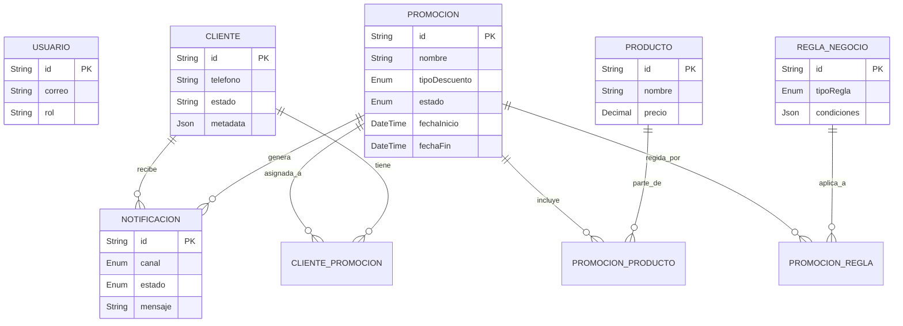

# Esquema de Base de Datos

El sistema utiliza un enfoque híbrido de persistencia de datos:
1.  **PostgreSQL**: Base de datos relacional principal para el núcleo del negocio.
2.  **MongoDB**: Base de datos documental para logs de auditoría y notificaciones masivas.

## Diagrama Entidad-Relación (PostgreSQL)

Este diagrama representa los modelos definidos en `prisma/schema.prisma`.



## Diccionario de Datos (PostgreSQL)

### Módulo de Autenticación
- **Usuario (`usuarios`)**: Operadores y administradores del sistema.
    - `rol`: ADMIN, OPERADOR, VISOR.

### Módulo de Clientes
- **Cliente (`clientes`)**: Destinatarios finales de las promociones.
    - `metadata`: Campo JSON flexible para almacenar datos extra sin migrar esquema (ej. preferencias, historial externo).

### Módulo de Promociones
- **Promocion (`promociones`)**: Campañas de marketing.
    - `estado`: BORRADOR, ACTIVA, PAUSADA, FINALIZADA.
    - `segmentoObjetivo`: Definición de a quién va dirigida.
- **Producto (`productos`)**: Items que pueden ser promocionados.
- **ReglaNegocio (`reglas_negocio`)**: Lógica dinámica para aplicar descuentos o filtrar clientes.
    - `condiciones`: JSON que define la lógica (ej. `{"edad": {">": 18}}`).

### Módulo de Notificaciones
- **Notificacion (`notificaciones`)**: Registro transaccional de un intento de comunicación.
    - `canal`: SMS, WHATSAPP, CORREO.
    - `estado`: PENDIENTE, ENVIADA, FALLIDA, etc.

## Esquema MongoDB (Notifications Service)

Utilizado para almacenar logs detallados que podrían crecer indefinidamente.

### Colección: `notification_logs`
```json
{
  "_id": "ObjectId",
  "notificationId": "UUID (ref a PostgreSQL)",
  "provider": "Twilio/SendGrid",
  "requestPayload": { ... },
  "responsePayload": { ... },
  "timestamp": "ISODate",
  "durationMs": 150
}
```
